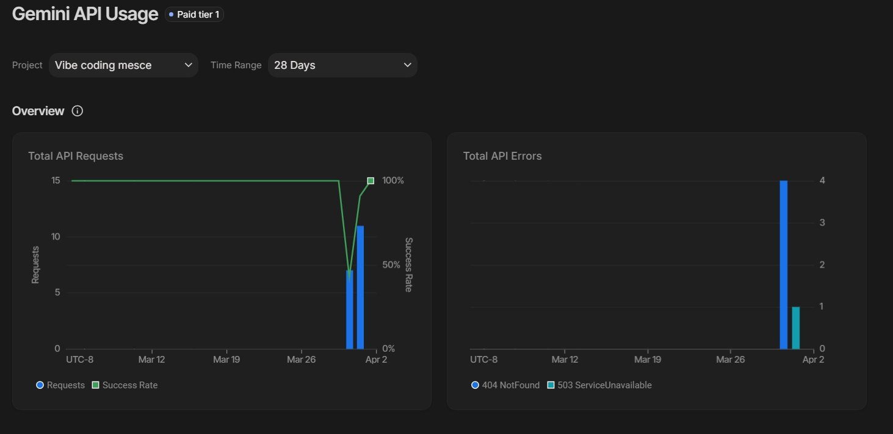
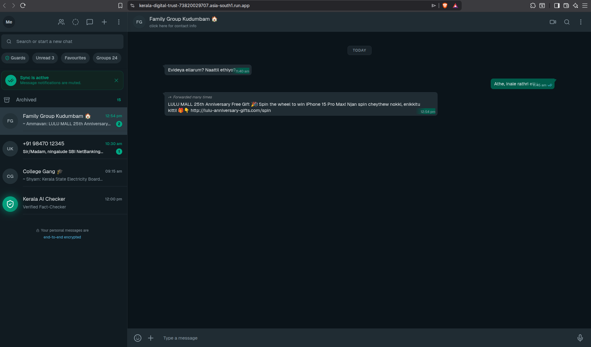
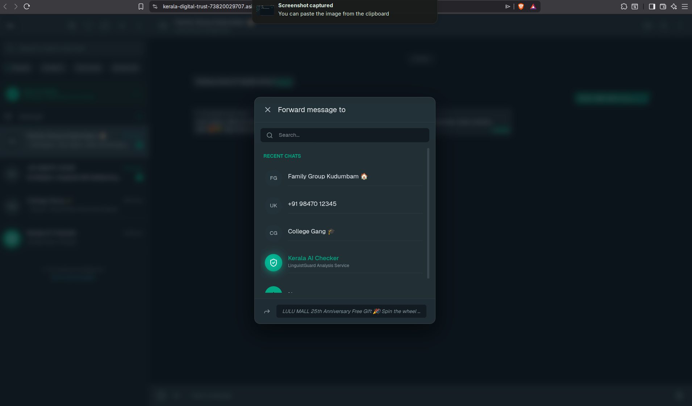
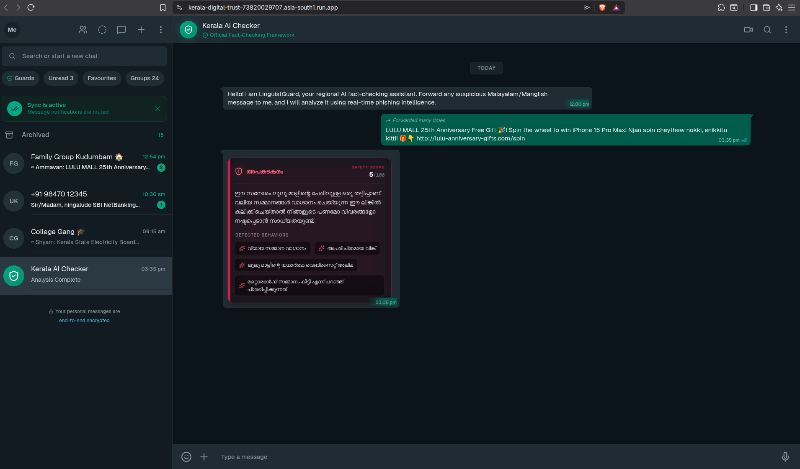
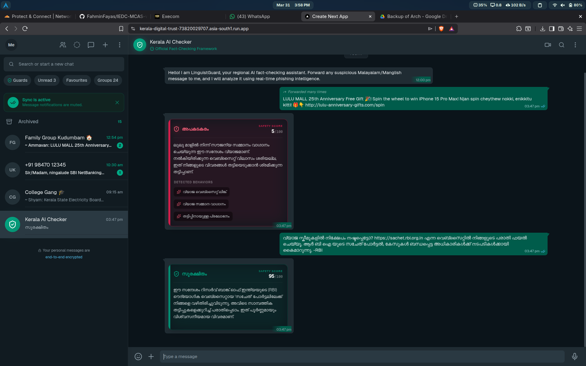

<div align="center">
  <h1>🛡️ Kerala AI Checker</h1>
  <h3>Kerala Digital Trust Fact-Checker</h3>
  <p><i>Winner / Submission for <b>Google 'Build with AI 2026' at MESCE</b></i></p>
  <p><b>Theme:</b> AI for Cybersecurity & Digital Trust</p>
  <br />
  <a href="https://kerala-digital-trust-73820029707.asia-south1.run.app/"><strong>🔗 Live Demo</strong></a>
</div>

<br />

## 🚨 The Real-World Problem

Elderly citizens and non-tech-savvy individuals in Kerala are increasingly targeted by sophisticated financial scams via WhatsApp forwards and SMS.

Because these scams are written in regional languages—specifically Malayalam or Manglish (Malayalam written in the English alphabet)—traditional English-centric spam filters completely fail to catch them.

**Common Scam Vectors:**
- ⚡️ **Fake KSEB Alerts:** Fraudulent Electricity Board disconnection notices that create absolute panic.
- 🏦 **Bank KYC Scams:** Urgent Federal Bank or SBI account block warnings forcing users to click malicious phishing links.
- 🎁 **Lottery/Giveaways:** Fake LuLu Mall 25th-anniversary spins or free mobile recharge forwards.

*These social engineering tactics use extreme urgency to fluster the elderly, resulting in severe financial loss.*

## 💡 The Solution: Kerala AI Checker

Kerala AI Checker is a highly accessible, mobile-first web application designed to act as a digital guardian for the elderly.

An elderly user, or their family member, can simply paste or forward a suspicious message into the chat interface. Under the hood, the app utilizes the **Google Gemini 1.5 Flash API** to contextually analyze the regional linguistic patterns.

### Key Features
- 🟢🟡🔴 **Visual Trust Score:** A clear Red/Yellow/Green dashboard indicating exactly how safe or dangerous a message is.
- 🧠 **Native Language Processing:** Built specifically to understand the nuances, slang, and urgency triggers in native Malayalam and Manglish.
- 📖 **Simplified Explanations:** The AI doesn't just block a message; it explains why it's a scam in simple, respectful, and crystal-clear terms that an elderly person can understand.

## 👥 The Human Impact: Protecting Kerala's Elderly

Cybersecurity shouldn't just be for the tech-savvy. For an elderly grandparent living alone in Kerala, the internet can be a terrifying minefield of deception. A simple WhatsApp message threatening to cut off their electricity can cause immense stress.

Kerala AI Checker bridges the digital divide. By utilizing powerful Generative AI, we provide vulnerable populations with an instant second opinion. It replaces panic with informed caution, preventing life savings from being drained by malicious actors exploiting regional linguistic blind zones.

## 🛠️ Tech Stack

- **Frontend:** Next.js (App Router), React, Tailwind CSS
- **AI Integration:** Google Generative AI SDK (powered by Gemini 1.5 Flash)
- **Deployment:** Google Cloud Run (Deployed natively and securely)
- **Design Pattern:** WhatsApp-styled Familiar UI/UX for minimum friction.

---

## Google AI Usage
### Tools / Models Used
- Google Gemini API (Gemini 1.5 Pro / Flash)
- Next.js (React Framework)
- Tailwind CSS & Framer Motion (for premium UI/UX)

### How Google AI Was Used
Google Gemini serves as the core linguistic intelligence engine of Kerala AI Checker. When a user queries a suspicious message, the text payload is securely transmitted to our `/api/analyze` backend via the frontend UI. 

We leverage Gemini's advanced multi-lingual and contextual reasoning capabilities to parse complex Malayalam and "Manglish" slang. Gemini performs zero-shot classification to detect psychological manipulation (false urgency, threats, too-good-to-be-true offers) and evaluates links. Gemini then structures the response into a strict JSON format containing a `trust_score`, `verdict`, localized `explanation`, and an array of `red_flags`, which the frontend uses to render the glassmorphic response card dynamically.

---

## Proof of Google AI Usage
Attach screenshots in a `/proof` folder:




---

## Screenshots 
Add project screenshots showcasing the UI and Fact-Checking process:

  




---

## Demo Video
Upload your demo video to Google Drive and paste the shareable link here (max 3 minutes).
[Watch Demo](https://drive.google.com/file/d/1SbFAQZyyWt60V6IiMvCjoLuCjmiqbFKZ/view?usp=sharing) 

---

## Installation Steps

```bash
# Clone the repository
git clone https://github.com/Faheem-Musthafa/kerala-digital-trust-or-whatsapp-fact-checker.git

# Go to project folder
cd kerala-digital-trust-or-whatsapp-fact-checker

# Install dependencies
npm install

# Run the project
npm run dev
```
