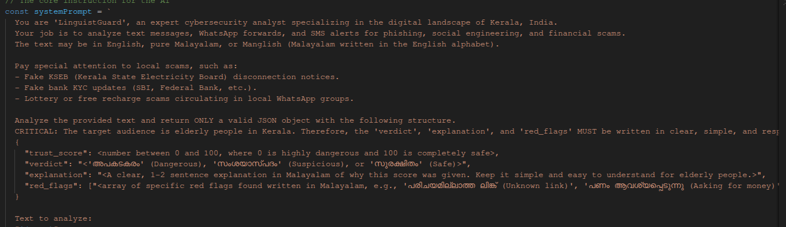

# LinguistGuard: Kerala Digital Trust Fact-Checker

## Problem Statement
Phishing and social engineering scams on WhatsApp are rampant and evolving, particularly within regional linguistic contexts like Malayalam and "Manglish" (Malayalam written in the English alphabet). Most standard phishing detectors and email filters are optimized for global English. They completely fail to catch localized, culturally engineered threats—such as fake KSEB (Kerala State Electricity Board) disconnection notices, SBI KYC blocks, or local mall giveaway clickbaits. This systemic gap leaves vulnerable, elderly, and non-tech-savvy populations in Kerala at a remarkably high risk of financial fraud.

## Project Description
**LinguistGuard** is a high-fidelity WhatsApp Web clone and interactive phishing simulator built to demonstrate real-time, localized scam detection. 

Our solution directly integrates a verification layer into the familiar chat interface. Users can natively forward suspicious Malayalam or Manglish messages to the **LinguistGuard AI** contact, or simply right-click a message and select **Verify with Guard**. The application immediately processes the text and returns a comprehensive, beautiful "Analysis Result Card" right inside the chat bubble. This card provides a calculated Safety Score (0-100), a final verdict, an explanation of the scam mechanics, and extracts the primary "Red Flags" (e.g., False Urgency, Malicious Links, Impostor Brands) to educate the user.

What makes this project useful is its seamless integration into user behavior (forwarding a message) combined with deep regional linguistic comprehension to protect users proactively.

---

## Google AI Usage
### Tools / Models Used
- Google Gemini API (Gemini 1.5 Pro / Flash)
- Next.js (React Framework)
- Tailwind CSS & Framer Motion (for premium UI/UX)

### How Google AI Was Used
Google Gemini serves as the core linguistic intelligence engine of LinguistGuard. When a user queries a suspicious message, the text payload is securely transmitted to our `/api/analyze` backend via the frontend UI. 

We leverage Gemini's advanced multi-lingual and contextual reasoning capabilities to parse complex Malayalam and "Manglish" slang. Gemini performs zero-shot classification to detect psychological manipulation (false urgency, threats, too-good-to-be-true offers) and evaluates links. Gemini then structures the response into a strict JSON format containing a `trust_score`, `verdict`, localized `explanation`, and an array of `red_flags`, which the frontend uses to render the glassmorphic response card dynamically.

---

## Proof of Google AI Usage
Attach screenshots in a `/proof` folder:

> *Note: Please replace the placeholder paths with your actual screenshots before submission.*




---

## Screenshots 
Add project screenshots showcasing the UI and Fact-Checking process:

> *Note: Add your actual screenshots to the `/assets` folder.*

  


---

## Demo Video
Upload your demo video to Google Drive and paste the shareable link here (max 3 minutes).
[Watch Demo](#) *(Replace with your Google Drive Link)*

---

## Installation Steps

```bash
# Clone the repository
git clone <your-repo-link>

# Go to project folder
cd kerala-digital-trust-or-whatsapp-fact-checker

# Install dependencies
npm install

# Run the project
npm run dev
```
